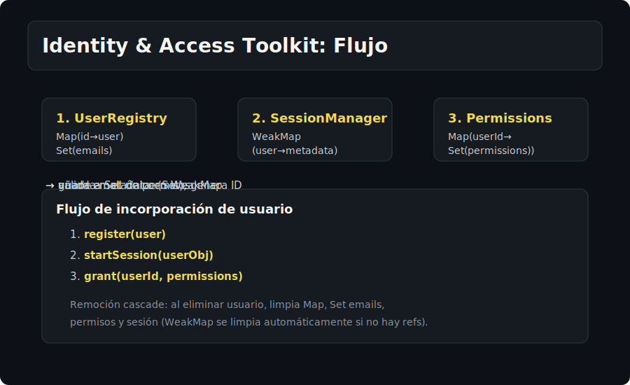

# Proyecto - Identity & Access Toolkit

Sistema para gestionar usuarios únicos, sesiones y permisos usando Sets, Maps y WeakMaps, garantizando unicidad, orden y control de ciclo de vida.

## 🎯 Objetivos
- Aplicar Set para garantizar unicidad de emails e IDs.
- Usar Map para asociar datos de usuarios y permisos con claves estables.
- Implementar caché de metadatos con WeakMap (sesiones, tokens efímeros).
- Manejar operaciones CRUD con reportes consistentes (listados, búsquedas, conteos).

## 🧩 Requerimientos
### Módulos mínimos
1. **UserRegistry**: gestiona usuarios con IDs únicos (usa Map id -> user, Set para emails).
   - `register(user)`: valida unicidad de email, genera ID único si no existe.
   - `getUser(id)`: devuelve usuario por ID.
   - `findByEmail(email)`: devuelve usuario por email.
   - `listAll()`: array de usuarios en orden de registro.
   - `remove(id)`: elimina del Map y del Set de emails.

2. **SessionManager**: gestiona sesiones activas con WeakMap (asocia objeto user -> metadata).
   - `startSession(userObj, metadata)`: almacena en WeakMap.
   - `getSession(userObj)`: recupera metadata o null.
   - `endSession(userObj)`: elimina entrada del WeakMap.
   - `clearAll()`: resetea WeakMap interno.

3. **PermissionsManager**: controla permisos por usuario (Map id -> Set de permisos).
   - `grant(userId, permission)`: añade permiso al Set del usuario.
   - `revoke(userId, permission)`: elimina permiso del Set.
   - `hasPermission(userId, permission)`: verifica si tiene el permiso.
   - `listPermissions(userId)`: devuelve array de permisos del usuario.

### Flujo integrado
- `register → startSession → grant` para incorporación de usuario.
- `endSession` cuando cierre sesión o timeout.
- `remove` debe limpiar usuarios, sesiones y permisos asociados.

## 🗂️ Entregables
- `starter/`: esqueletos de los tres módulos y flujo de integración (CLI opcional).
- `solution/`: implementación de referencia con validaciones y manejo de edge cases (usuarios ya existentes, sesiones inexistentes, remoción consistente).

## 🚦 Criterios de aceptación
- Unicidad de email garantizada por Set.
- Sessions no retienen referencias innecesarias (uso correcto de WeakMap).
- Remoción en cascade: al borrar usuario, también limpia permisos y sesión.
- Código modular: cada manager encapsula su colección interna.

## 💻 Ejecución
- Opcional CLI: `node app.js register <email> <name>`, `node app.js session <id>`, etc.
- Usa `pnpm`/`yarn` si agregas dependencias (evitar npm).

## 🧪 Casos a cubrir
- Registrar usuarios con mismo email (debe rechazar).
- Sesiones de usuarios eliminados (deben desaparecer automáticamente).
- Permisos duplicados en un mismo usuario (Set evita duplicados).
- Listados siempre en orden de inserción.
